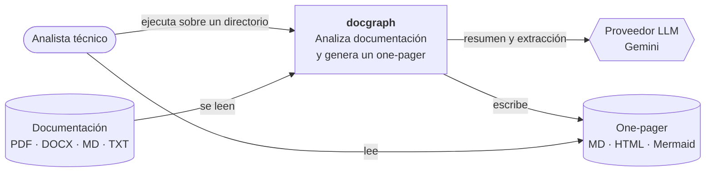
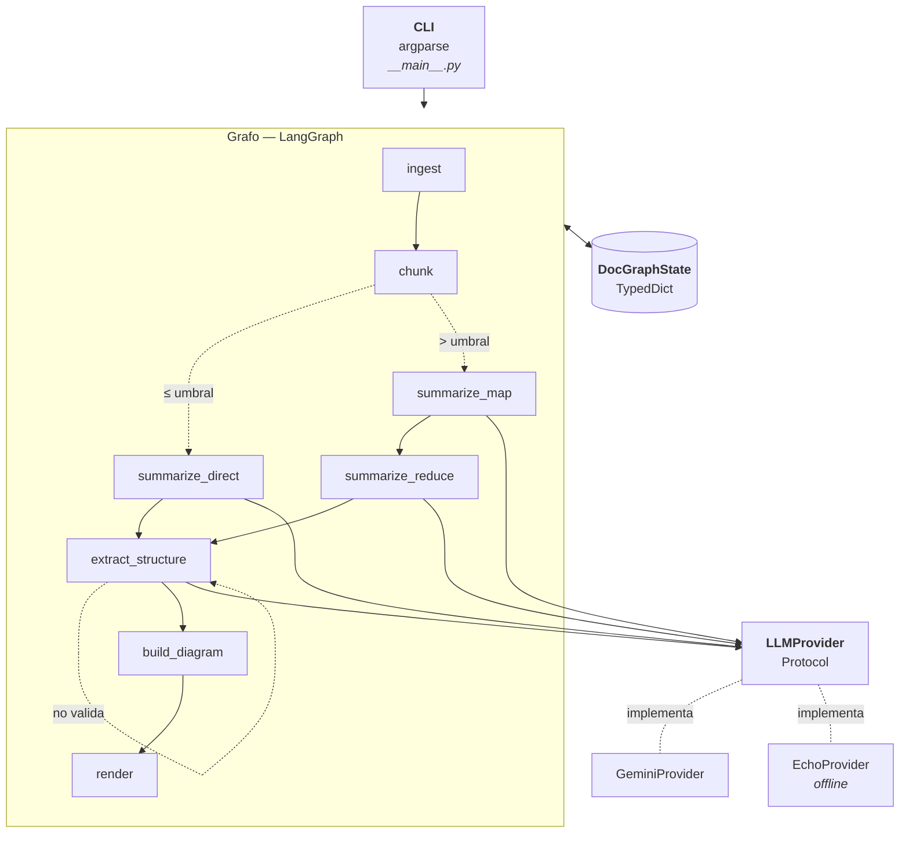

# Arquitectura

Notación [C4](https://c4model.com/), niveles 1 y 2. El nivel 3 no aporta
aquí: los componentes internos son los nodos del grafo y están descritos en
el README.

## Nivel 1 — Contexto

## Nivel 2 — Contenedores

## Puntos de extensión

| Quiero… | Toco… |
| --- | --- |
| Añadir un proveedor | Una clase en `llm/provider.py` que cumpla el protocolo |
| Soportar otro formato | Un lector en `nodes/ingest.py` y su entrada en `_READERS` |
| Cambiar el modelo extraído | `models.py`; el diagrama y el render se adaptan solos |
| Añadir un paso | Un nodo en `nodes/` y su arista en `graph.py` |

## Flujo del estado

Cada nodo recibe el estado completo y devuelve **solo las claves que
modifica**; LangGraph las mezcla. Dos claves usan reducción aditiva
(`operator.add`) porque se escriben desde varios puntos:

- `chunk_summaries` — la fase map acumula un resumen por fragmento.
- `errors` — cualquier nodo puede registrar una incidencia sin abortar.

Esa distinción es lo que permite que el pipeline **degrade en lugar de
romperse**: un fragmento que falla resta calidad al resumen, no invalida la
ejecución.
